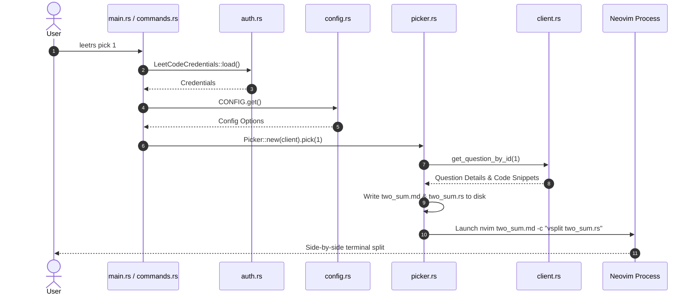

# 🏗️ Architecture Overview

`leetrs` is designed as a modular, asynchronous Rust crate focused on performance, clean separation of concerns, and robust error handling.

---

## 🧱 Module Structure

The Rust codebase (`src/`) is organized into dedicated modules:

| Module | Source File | Description |
|---|---|---|
| **`auth`** | `src/auth.rs` | Encapsulates browser cookie extraction (`rookie`) and credential persistence |
| **`client`** | `src/client.rs` | Authenticated HTTP client managing LeetCode REST and GraphQL API queries |
| **`models`** | `src/models/` | Serde-compatible data models (`ProblemSummary`, `Question`, `Submission`, `Language`) |
| **`picker`** | `src/picker.rs` | Main workflow orchestrator connecting client, caching, disk I/O, and editor launching |
| **`tui`** | `src/tui/` | Ratatui rendering engine, screen state management, and custom widget components |
| **`services`** | `src/services/` | Polling and submission handling logic |
| **`cache`** | `src/cache.rs` | Disk caching service for problem list metadata (`data.json`) |
| **`config`** | `src/config.rs` | Global configuration manager backed by `OnceLock<Config>` |
| **`format`** | `src/format.rs` | Terminal colorizing and result formatting utilities |
| **`error`** | `src/error.rs` | Custom error types implemented with `thiserror` (`EngineError`) |

---

## 🔄 Core Execution Pipeline

