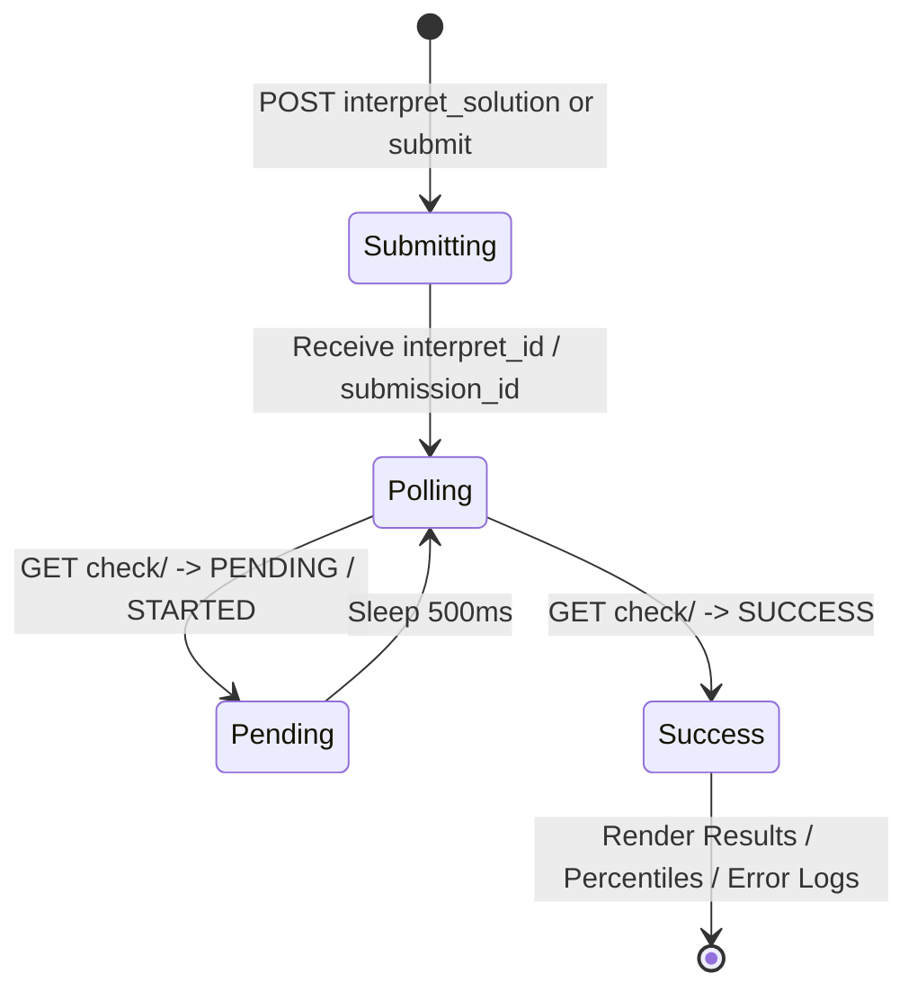

# ⚙️ Submission & Judge Engine

The submission service (`src/services/submission.rs`) manages non-blocking async execution against LeetCode's judging servers.

---

## 🔄 Judge Lifecycle Diagram

---

## 📊 Result Status Mapping

The submission engine handles all judge response states:

- **`Accepted`**: Renders green victory stats, runtime percentile, memory percentile, and total passed test cases.
- **`Wrong Answer`**: Displays expected output vs actual code output, input test case, and failing test index.
- **`Compile Error`**: Colorizes and prints compiler output log.
- **`Runtime Error`**: Prints error exception message and stack trace.
- **`Time Limit Exceeded`**: Alerts when algorithm complexity exceeds time bounds.
