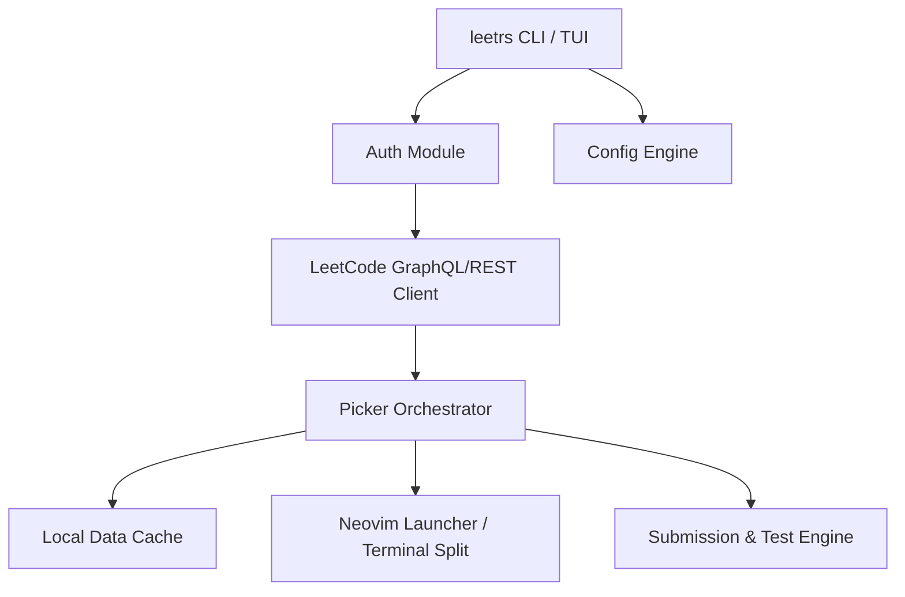

# 🚀 Welcome to leetrs

**`leetrs`** is a blazing-fast, Rust-powered CLI engine and interactive Terminal User Interface (TUI) designed for solving LeetCode problems natively within **Neovim**.

By combining terminal-native browsing, automatic browser authentication, and automated side-by-side Neovim buffer splitting, `leetrs` removes browser friction and lets you focus entirely on problem-solving.

---

## ✨ Key Features

- **🖥️ Interactive TUI Browser (`leetrs tui` / `leetrs`)**
  - Instant fuzzy search across thousands of LeetCode problems by title or numerical ID.
  - Difficulty filters (**Easy**, **Medium**, **Hard**) and topic tag overlays (e.g., Array, Dynamic Programming, Graph).
  - Status indicators for solved state (`ACCEPTANCE`), subscription locks, and premium gates.
  - One-key web browser fallback (`o`) and interactive help panel (`?`).

- **🔑 Intelligent Cookie Authentication (`leetrs auth`)**
  - Automatically extracts `LEETCODE_SESSION` and `csrftoken` cookies directly from active **Chrome** or **Firefox** browser profiles.
  - Manual token fallback for custom, headless, or containerized browser environments.

- **📝 Frictionless Problem Fetching (`leetrs pick`)**
  - Fetch problems by URL slug (e.g., `two-sum`) or numerical ID (e.g., `1`).
  - Converts raw HTML problem descriptions into clean, 80-column wrapped terminal Markdown.
  - Generates idiomatic code templates (`two_sum.rs`, `two_sum.py`, `two_sum.sql`) with pre-populated function stubs and metadata headers.

- **⚡ Native Neovim Integration**
  - Spawns Neovim with a vertical split (`vsplit`): problem description in the left pane, solution code stub in the right pane.

- **🧪 Async Testing & Submission Engine (`leetrs test` / `leetrs submit`)**
  - Run code against sample test cases locally without polluting official submission history.
  - Asynchronously submit solutions to LeetCode judging servers and view real-time judge results, runtime/memory percentiles, and compiler error tracebacks.

---

## 🏗️ Architecture Highlight

`leetrs` is built as a single, decoupled Rust binary that serves both CLI execution and TUI rendering:

---

## ⚡ Quick Navigation

Ready to dive in? Check out these essential sections:

- 🚀 [**Quickstart Guide**](./getting-started/quickstart.md) — Get up and running in under 5 minutes.
- 📦 [**Installation Guide**](./getting-started/installation.md) — Install via Cargo, Homebrew, or Shell Installer.
- 💻 [**CLI Command Reference**](./cli-reference/overview.md) — Comprehensive reference for all `leetrs` subcommands.
- ⌨️ [**TUI Keybindings**](./tui-guide/interactive-browser.md) — Master the interactive terminal problem browser.
- 🏗️ [**Architecture & Internals**](./architecture/overview.md) — Learn how `leetrs` is designed under the hood.
